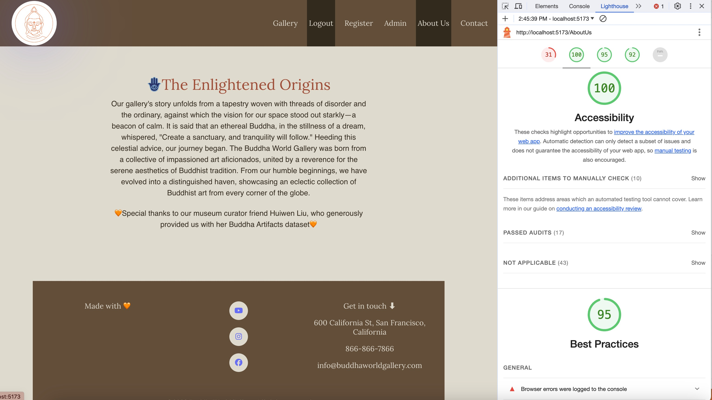

# BuddhaWorldGallery_v2

BuddhaWorldGallery_v2 was improved upon our previous project BuddhaWorldGallery. We conducted 6 user interviews and gathered 70+ feedbacks. Among which, we adapted 20 feedbacks and turned it into a totally different website. The website It is an online website for art lovers to be able to browse, filter, and upload buddhism artifacts across the world. Users will be able to filter artifacts based on the dynasty they like and leave comments about their favorite artifacts.

## Authors

Huiqin Hu & Xiaolin Liu

## Project links

Deployed Site: https://buddhaworldgalleryv2.onrender.com/

Walkthrough Video: https://youtu.be/aqTxBpgMDxQ

Slides: https://docs.google.com/presentation/d/1BLh-pEzHOWQlM3UfBOyLuR4BTXSFiQuxRURX0yo7R4U/edit?usp=sharing

Design Document can be found [here](./design-document.md)

Class Link: https://johnguerra.co/classes/webDevelopment_fall_2023/

## Disclaimer

Some data in this project are synthetic fictitious data and for educational and demonstration purposes only

## Project v2 Objective

1. Conduct user interviews and gather feedback

2. Decide which feedbacks to adapt to - prioritize, priotizie, prioritize!

3. Implement user authentication and access control

## Project v1 Objective

1. Create an online gallery to showcase important buddha artifacts across the world

2. Allow Buddhist art lovers to search up artifacts by their historical time periods (dynasty)

3. Allow art lovers across the world to curate this database together - users can “read” the current database through our online gallery, they can also create, update and delete data from our dataset, helping us curate this dataset

4. Allow art lovers across the world to comment below their favorite artifacts - comments could be created, read, updated and deleted

## Font Choices and Color Palettes

We chose to use Garamond and Lora for the font of our website. Garamond is a classic and elegant serif font that has been widely used in the context of art and culture, and Lora is a well-balanced serif font that exudes elegance and sophistication, well-suited for our Buddha Gallery website.

Color palette of this website was extracted from the inpiration of this picture:


This picture is also an artifact from Longmen Grottoes, where our displayed artifacts are originally from. By utilizing a color palette inspired by an artifact from the Longmen Grottoes, we hope to weave a visual connection to the cultural and historical context of the artifacts displayed. This choice not only honors the original artistic vision but also subtly acknowledges the narrative of displacement these pieces have endured. The colors will provide a cohesive and aesthetically resonant backdrop that echoes the authenticity and emotional depth of the artifacts, reinforcing the website's purpose of showcasing the heritage and the ongoing story of these important works.
Our color palette in RGB color value:


## Lighthouse Accessibility Score

The website passed lighthouse accessibility test and received a 100 score.


## Screenshots

Main page: gallery


Artifact Detail page


Upload artifact


About us


Contact


## Functionalities / Pages

### Functionalities

- CRUD Operations on Gallery
- CRUD Operations on Comment
- Search Feature on Gallery
- React hook components
- Contact Us Form

### Pages

- Home Page/Gallery Page - users can browse our gallery database, search artifact, and upload an artifact
- Artifact Detail Page - users can edit and delete artifact. They can also see the comment section that belongs to that artifact, as well as being able to edit, delete and upload comments
- About Us: users can read up more about us
- Contact: users can contact us

## Installation

To set up BuddhaWorldGallery2.0, you will need the following:
Clone the repository, then enter into root folder and run below commands to install dependencies:

```
npm install
```

Install frontend dependencies:

```
cd front
npm install
```

and in the same front folder to run frontend server:

```
npm run dev
```

To run backend server from the root folder:

```
npm run start
```

## Databse

This assumes that you have a Mongo server running on localhost: 27017, or configured in the `MONGOMONGODB_URI` environment variable.
Enter below string to import our database:

```
mongoimport --db buddhaWorld --collection ListedArtifacts --file db/ListedArtifacts.json --jsonArray
```

## Dependencies:

### Backend server

```
    "crypto": "^1.0.1",
    "bootstrap": "^5.3.2",
    "connect-mongo": "^5.1.0",
    "cookie-parser": "~1.4.4",
    "debug": "~2.6.9",
    "dotenv": "^16.3.1",
    "express": "^4.18.2",
    "express-session": "^1.17.3",
    "mongodb": "^6.2.0",
    "morgan": "~1.9.1",
    "passport": "^0.7.0",
    "passport-local": "^1.0.0",
    "vite": "^4.5.0"
```

### Frontend dependencies

```
    "bootstrap": "^5.3.2",
    "dotenv": "^16.3.1",
    "react": "^18.2.0",
    "react-bootstrap": "^2.9.1",
    "react-dom": "^18.2.0",
    "react-hook-form": "^7.48.2",
    "react-router-dom": "^6.18.0"
    "@fortawesome/fontawesome-svg-core": "^6.5.1",
    "@fortawesome/free-brands-svg-icons": "^6.5.1",
    "@fortawesome/free-solid-svg-icons": "^6.5.1",
    "@fortawesome/react-fontawesome": "^0.2.0",
```

## License

# This project is licensed under the MIT License.

# BuddhaWorldGallery_v2
